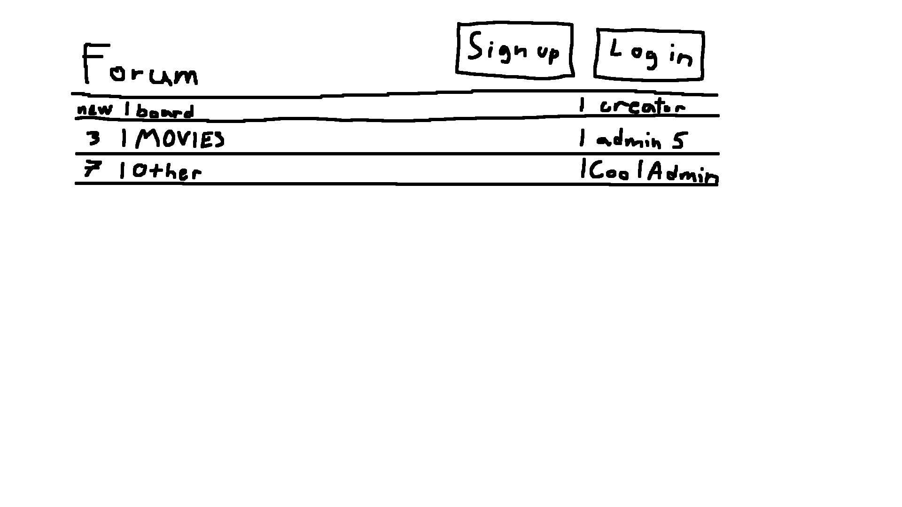
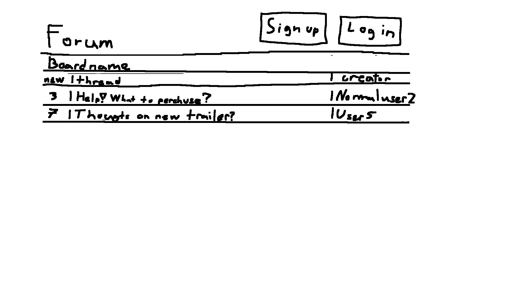
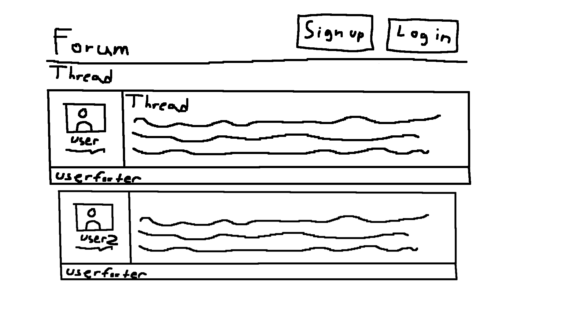
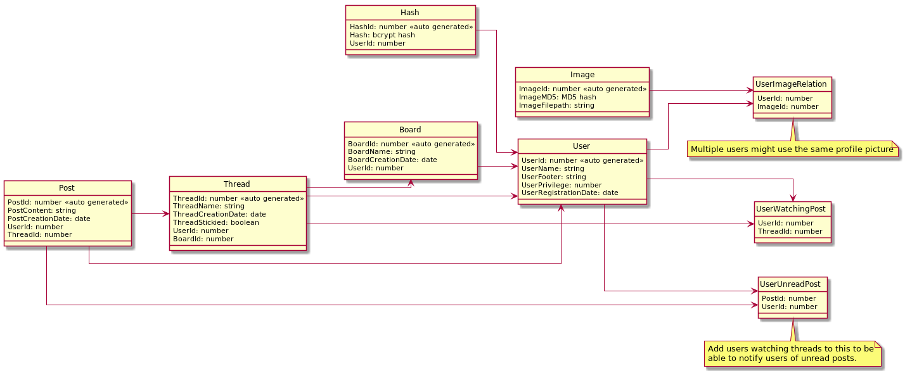

# Projektplan

## 1. Projektbeskrivning (Beskriv vad sidan ska kunna göra).

Jag kommer att skapa ett rätt standard, men komplett webbforum, med fokus på funktionalitet över utseende (samt att jag gillar looken av äldre hemsidor). Det kommer gå att kolla på hemsidan som en gäst, att registrera ett vanligt användar konto, samt att skapa administratör konton via ett litet ruby program som pratar med databasen.

Vanliga konton ska kunna skapa trådar, svara på trådar, redigera samt ta bort sina inlägg, och flagga inlägg så att administratörer kan kolla på de. Administratör konton ska kunna skapa kategorier, ta bort allas meddelanden och fästa trådar högst upp i kategorier.

Alla konton ska ha ett användarnamn, en profil bild, och en liten "footer" som hamnar under alla deras inlägg. 

## 2. Vyer (visa bildskisser på dina sidor).

### Tidig hem vy som visar kategorier (så kallade boards), hur många nya trådar som finns där, och vilken administratör som skapade det boardet

### Tidig Board vy som visar trådar, hur många nya replies det finns på posten och vilken användare som skapat tråden

### Tidigt tråd vy som visar hur en tråd kan se ut, samt profil bild och användar footer

## 3. Databas med ER-diagram (Bild på ER-diagram).

### Databas diagram genererat av plantuml (se [database.plantuml](database.plantuml) för källkod)

## 4. Arkitektur (Beskriv filer och mappar - vad gör/innehåller de?).
