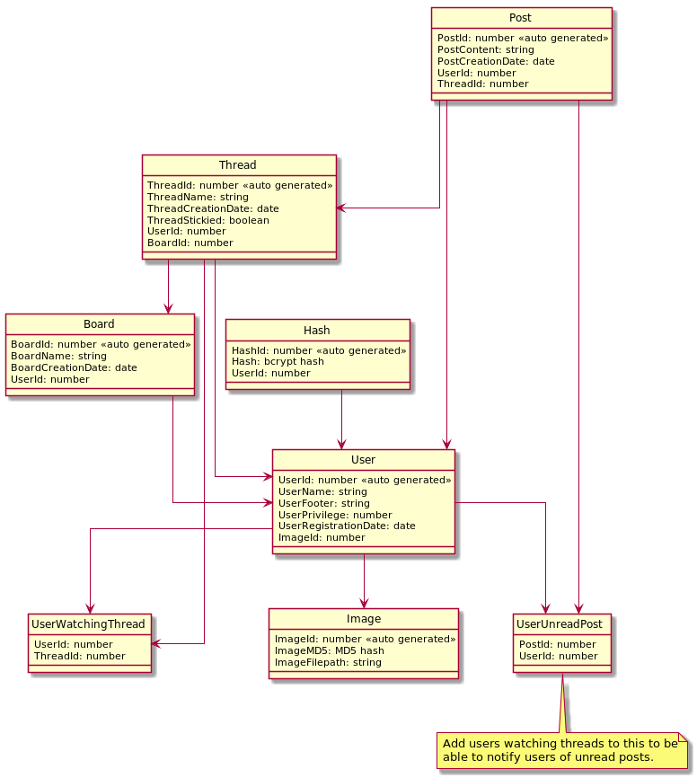

# Projektplan

## 1. Projektbeskrivning (Beskriv vad sidan ska kunna göra).

Jag kommer att skapa ett rätt standard, men komplett webbforum, med fokus på funktionalitet över utseende (samt att jag gillar looken av äldre hemsidor). Det kommer gå att kolla på hemsidan som en gäst, att registrera ett vanligt användar konto, samt att skapa administratör konton via ett litet ruby program som pratar med databasen.

Vanliga konton ska kunna skapa trådar, svara på trådar, redigera samt ta bort sina inlägg, och flagga inlägg så att administratörer kan kolla på de. Administratör konton ska kunna skapa kategorier, ta bort allas meddelanden och fästa trådar högst upp i kategorier.

Alla konton ska ha ett användarnamn, en profil bild, och en liten "footer" som hamnar under alla deras inlägg. 

## 2. Vyer (visa bildskisser på dina sidor).

### Tidig hem vy som visar kategorier (så kallade boards), hur många nya trådar som finns där, och vilken administratör som skapade det boardet


### Tidig Board vy som visar trådar, hur många nya replies det finns på posten och vilken användare som skapat tråden


### Tidigt tråd vy som visar hur en tråd kan se ut, samt profil bild och användar footer


## 3. Databas med ER-diagram (Bild på ER-diagram).

### Databas diagram genererat av plantuml (se [database.plantuml](database.plantuml) för källkod)


## 4. Arkitektur (Beskriv filer och mappar - vad gör/innehåller de?).

Detta GitHub repo är indelat i mappen src och docs, där src är källkod och docs är denna dokumentation. Dokumentationen kommer inte att kommenteras här men strukturen av src mappen görs det.

```
src
|-- Gemfile
|-- README.md
|-- Rakefile
|-- controller.rb
|-- db
|   `-- database.sqlite
|-- model.rb
|-- public
|   |-- css
|   |   `-- style.css
|   `-- img
|       `-- default.jpg
|-- view.rb
`-- views
    |-- board
	|   `-- index.slim
	|-- home
	|   |-- error.slim
	|   `-- index.slim
	|-- layout.slim
	|-- post
	|   `-- edit.slim
	|-- thread
	|   `-- index.slim
	`-- user
		|-- edit.slim
		|-- index.slim
		|-- login.slim
		|-- register.slim
		`-- unread.slim

```

### Gemfile

gemfile är en fil som beskriver vilka gems som behövs för mitt projekt och används utav ruby's `bundle` kommando för att installera gems.

### README.md

readme filen beskriver hur man installerar gems och startar projektet

### Rakefile

rakefile filen är anvsarig för att automatiskt köra kommandon som att generera dokumentation, installera gems, skapa en tom databas, resetta databasen eller starta servern. readme filen förklarar hur dessa saker görs.

### controller.rb

controller.rb innehåller kod för alla routes och inget annat. den utför databas operationer genom DataBaseHandler klassen definerad i model.rb

### db

db mappen innehåller bara databasen som heter database.sqlite. denna databas skapas när man kör setupen med rake.

### model.rb

model.rb definerar alla databas operationer och gömmer dessa i en database klass, samt några helper funktioner som hanterar sessions och en Validator klass som validerar input. All databass error handling görs även i denna fil, vilket gör det säkrare då man måste kolla så att användaren får göra något för att kunna göra det, då alla metoder tar en "caller id".

### public

public mappen har bara några publika filer som ett css stylesheet och en default profilbild. profilbilden uppladdade av användare hamnar också i public/img mappen

### view.rb

view.rb mappen innehåller alla error strängar, namnet på sidan samt alla html sanitization (används för forum posts och footers). detta så att inställningar, och eller språk lätt går att ändra utan att skriva om hela programmet.

### views

views innehåller alla slim filer

#### board

innehåller index.slim, som laddas av /board/:id, vilket visar alla trådar på ett board.

#### home

inehååler index.slim, som laddas av /home (redirect från /) och visar alla board, och error.slim  som laddas från /home/error och visar error medelanden

#### layout.slim

layout filen som innehåller hela html `<head>` taggen samt menyn på toppen av sidan så att man slipper att lägga in det i varje slim fil.

#### post

i post finns endast edit.slim eftersom att det inte finns någon sida för att visa en enda post, denna komms åt från /post/:id/edit

#### thread

i denna mapp finns index.slim som visar alla posts i en tråd, som man kommer åt genom /thread/:id

#### user

i denna mapp finns destå fler filer

 * edit.slim - redigera sin användare, /user/:id/edit
 * index.slim - visa en användares profile, /user/:id
 * login.slim - logga in, /user/login
 * register.slim - skapa nytt konto, /user/register
 * unread.slim - visa olästa posts på "watch"ade trådar, /user/unread
